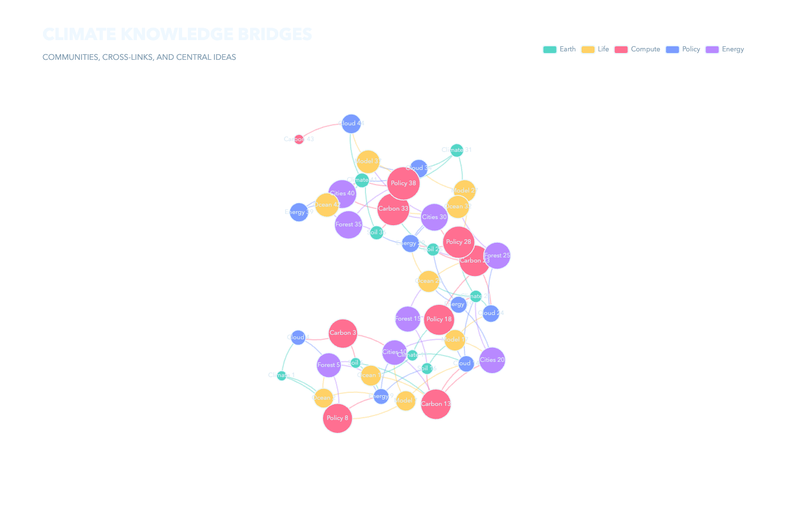
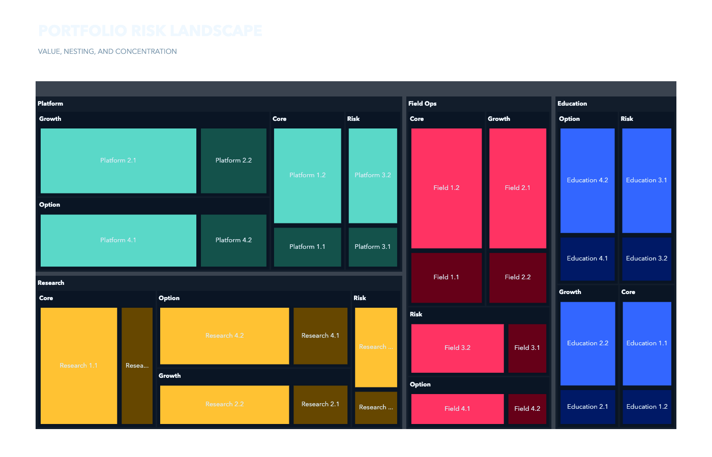
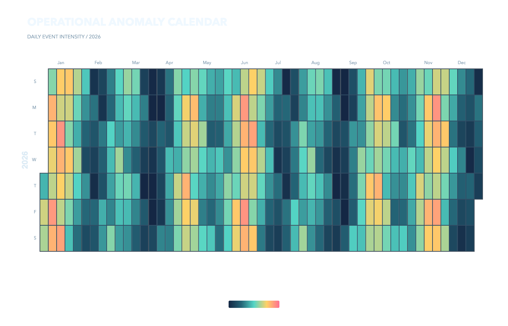
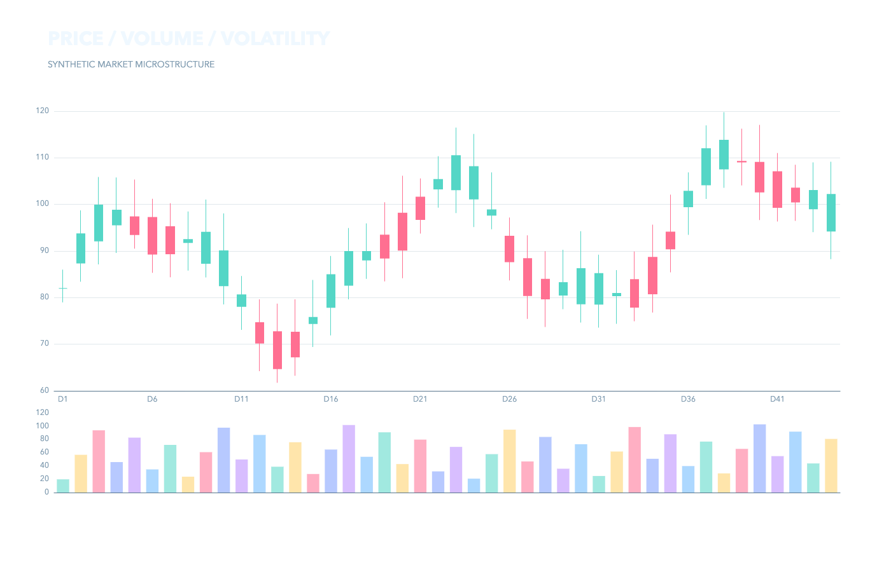
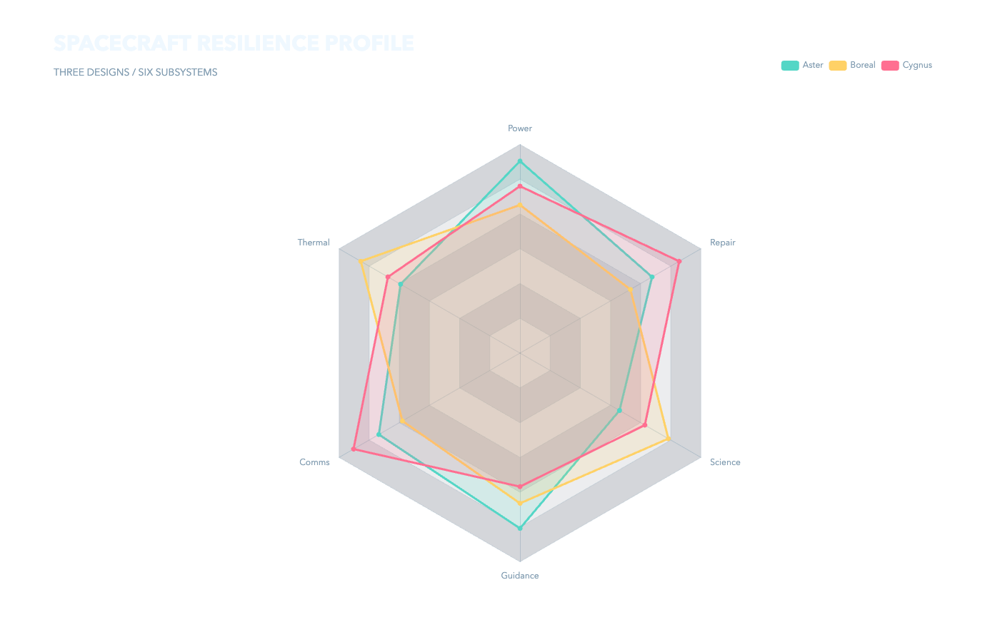
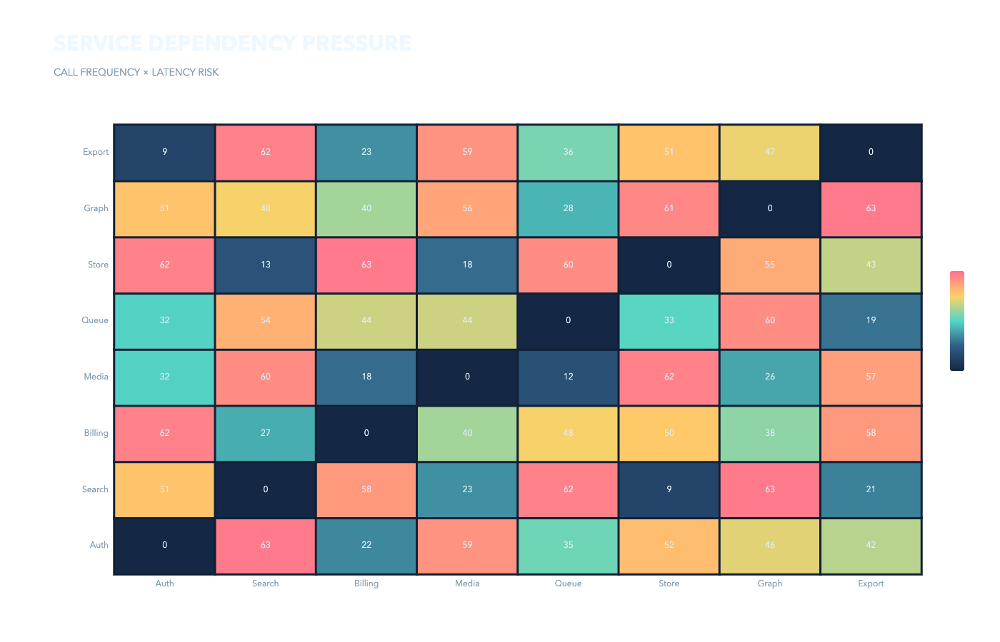
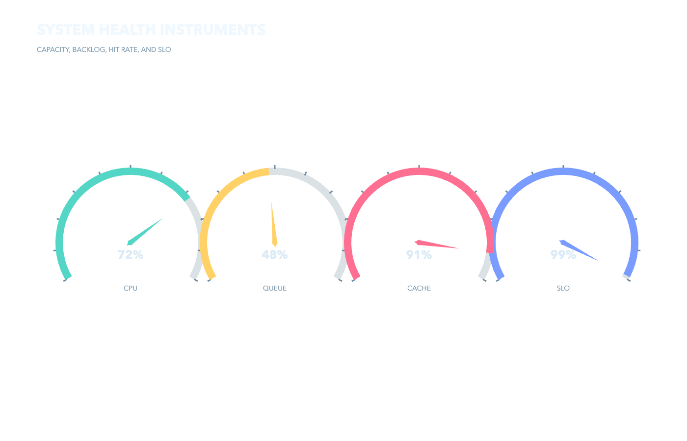
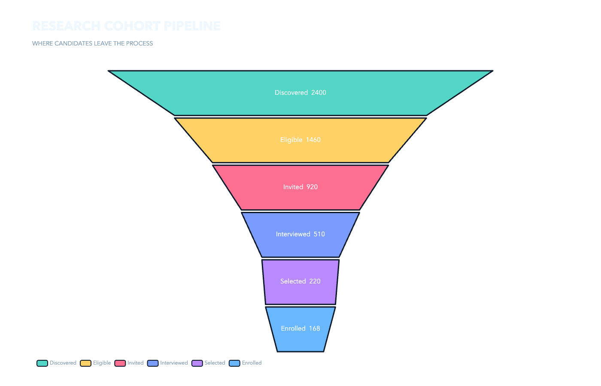
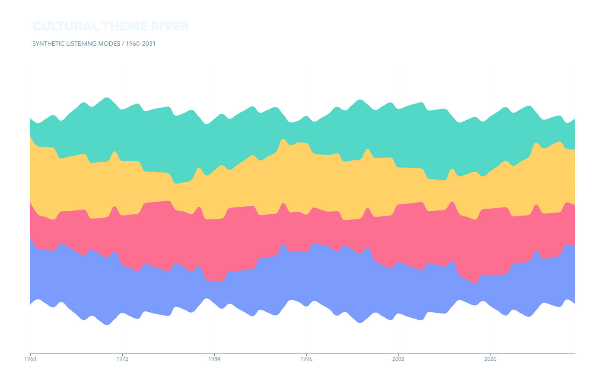

# ECharts Examples

Twelve polished, information-dense ECharts scenes with a deliberately transparent presentation layer.

`catalog.json` records the analytical use, question, chart family, complexity, and tags.

| Sankey | Sunburst | Parallel coordinates | Knowledge graph |
|---|---|---|---|
|  |  |  |  |
| Treemap | Calendar | Candlestick | Radar |
|  |  |  |  |
| Heatmap | Gauges | Funnel | Theme river |
|  |  |  |  |

Run `npm install && npm test` to type-check, build, exercise interactions in an offline real-browser run, export PNGs, and verify meaningful RGBA content.
