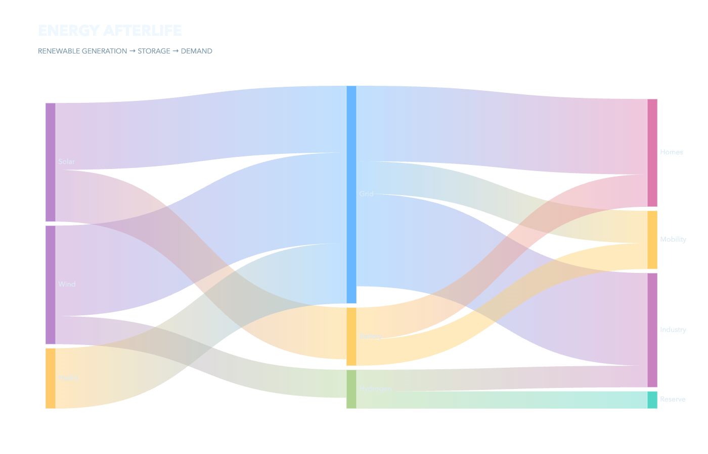
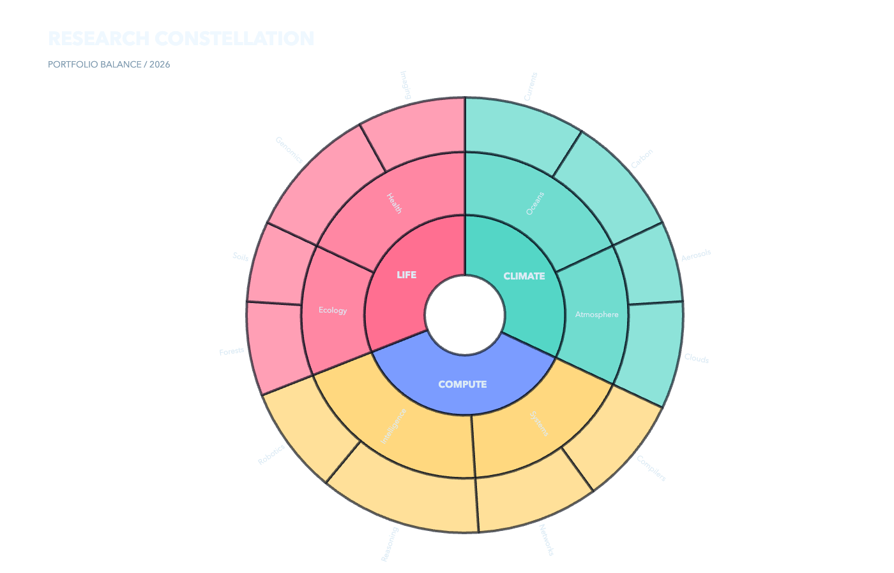
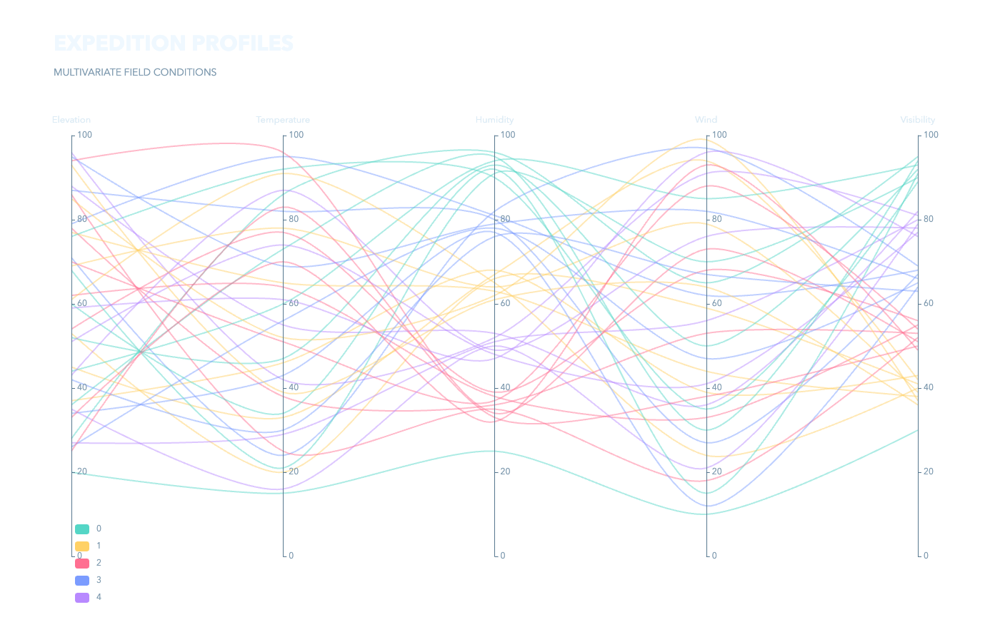

# ECharts Examples

Three polished, information-dense ECharts scenes with a deliberately transparent presentation layer.

| Scene | Preview |
|---|---|
| Renewable energy Sankey |  |
| Research portfolio sunburst |  |
| Expedition parallel coordinates |  |

Run `npm install && npm test` to type-check, build, exercise interactions in an offline real-browser run, export PNGs, and verify meaningful RGBA content.
